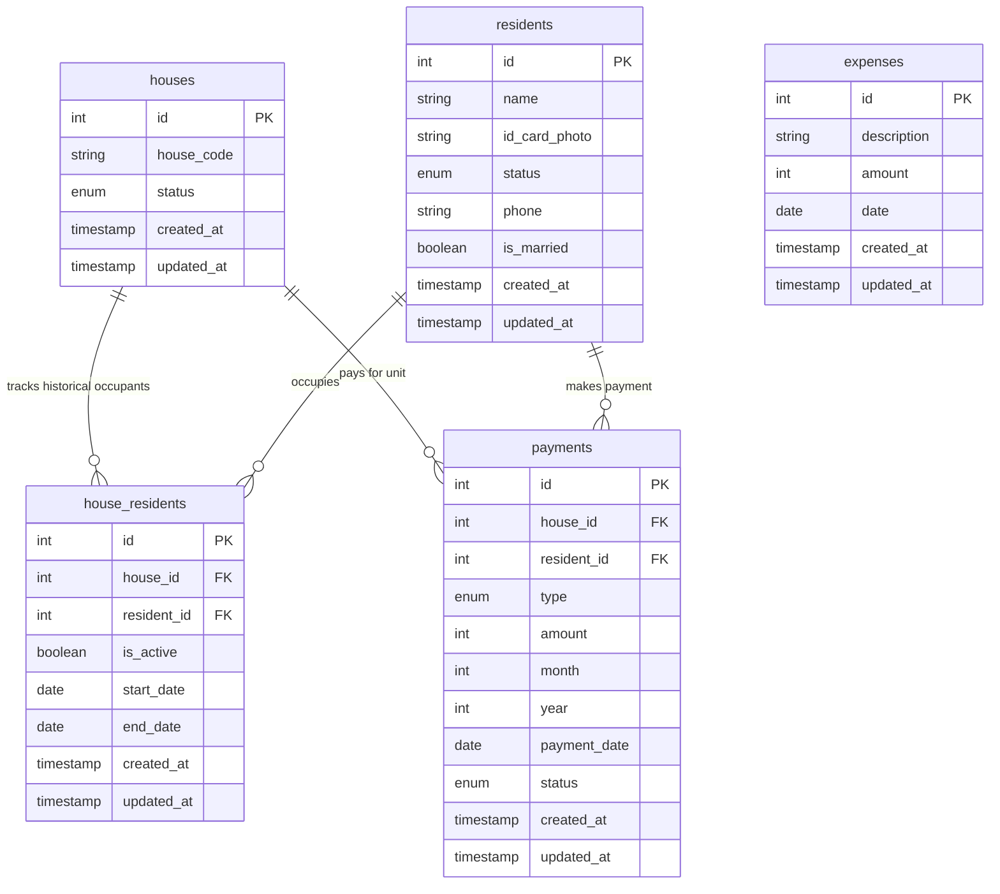

# Aplikasi Manajemen Administrasi & Keuangan RT

Aplikasi Full-Stack (Laravel 12 + React) untuk mengelola data warga, hunian rumah, riwayat okupansi, pembayaran iuran wajib bulanan (Kebersihan & Satpam), serta pencatatan pengeluaran kas RT.

Aplikasi ini menggunakan konfigurasi **Single-Server**, di mana React dibundel langsung ke dalam direktori public Laravel, sehingga Anda hanya perlu menjalankan satu server (`php artisan serve`) untuk menjalankan seluruh web app dan API.

---

## 1. Entity Relationship Diagram (ERD)

Berikut adalah skema database MySQL yang digunakan (dirender menggunakan sintaks Mermaid):



---

## 2. Panduan Instalasi & Cara Menjalankan (Single-Server)

### Prasyarat Sistem:
- PHP >= 8.2 (Disertai ekstensi pdo_mysql, gd, dll)
- Composer >= 2.x
- Node.js >= 18.x & NPM
- MySQL (XAMPP / Laragon)

---

### Langkah 1: Setup Lingkungan
1. Salin file lingkungan dan pasang dependensi PHP:
   ```bash
   copy .env.example .env
   composer install
   ```

2. Generate application key:
   ```bash
   php artisan key:generate
   ```

3. Konfigurasi `.env` Anda dengan kredensial MySQL local:
   ```env
   DB_CONNECTION=mysql
   DB_HOST=127.0.0.1
   DB_PORT=3306
   DB_DATABASE=system_rt
   DB_USERNAME=root
   DB_PASSWORD=
   ```

4. Buat database di MySQL (misal lewat phpMyAdmin) dengan nama `system_rt`.

5. Jalankan migrasi tabel beserta data seeders awal:
   ```bash
   php artisan migrate:fresh --seed
   ```
   *Catatan: Seeders akan membuat 20 rumah, data warga, history hunian, transaksi iuran 6 bulan terakhir, serta log pengeluaran bulanan secara otomatis agar statistik dashboard langsung terisi.*

6. Buat link storage untuk akses foto KTP:
   ```bash
   php artisan storage:link
   ```

---

### Langkah 2: Instalasi Dependensi Node & Build Aset
Pasang dependensi Node dan compile file React langsung ke folder public Laravel:
```bash
npm install
npm run build
```

---

### Langkah 3: Jalankan Server Tunggal
Untuk menjalankan aplikasi, Anda **hanya perlu menjalankan 1 server saja**:
```bash
php artisan serve
```

Buka browser Anda dan akses:
👉 **[http://127.0.0.1:8000](http://127.0.0.1:8000)**

*Tips Pengembangan (Development): Jika Anda sedang mengubah kode CSS/React dan ingin tampilan langsung ter-update secara otomatis di browser tanpa ketik `npm run build` berulang kali, jalankan perintah watcher ini di terminal kedua:*
```bash
npm run dev
```

---

## 3. Fitur Utama Aplikasi

1. **Dashboard Utama**:
   - Kartu KPI: Jumlah Warga, Unit Terisi/Kosong, Total Pemasukan Kas, Sisa Saldo Kas RT.
   - Grafik Interaktif (Pemasukan vs Pengeluaran) selama 12 bulan terakhir.
   - Daftar otomatis rumah yang menunggak (belum lunas) di bulan berjalan.
2. **Kelola Warga**:
   - Menambah & mengubah warga (Nama, Telepon, Status Nikah, Status Hubungan Tetap/Kontrak).
   - Unggah foto KTP warga secara aman dengan preview popup visual.
3. **Kelola Hunian Rumah**:
   - Peta interaktif grid 20 unit rumah berkode A-01 s/d A-20 (hijau = terisi, abu-abu = kosong).
   - Panel detail rumah: Menampilkan profil penghuni aktif saat ini & daftar riwayat penghuni masa lalu.
   - Fitur Asosiasi: Memasang penghuni baru atau mengosongkan rumah dengan otomatis mencatat tanggal mulai/selesai sewa.
4. **Kelola Penerimaan Iuran**:
   - Matriks Bulanan: Menampilkan status lunas/belum lunas untuk iuran Kebersihan dan Satpam per rumah.
   - Input Iuran Massal: Mendukung pembayaran beberapa bulan sekaligus (contoh: langsung bayar 12 bulan untuk Iuran Kebersihan).
5. **Kas & Pengeluaran**:
   - Pencatatan pengeluaran kas RT (Keterangan, Nominal, Tanggal).
   - Buku Kas Bulanan: Laporan rinci ledger kas masuk & kas keluar untuk bulan tertentu.
