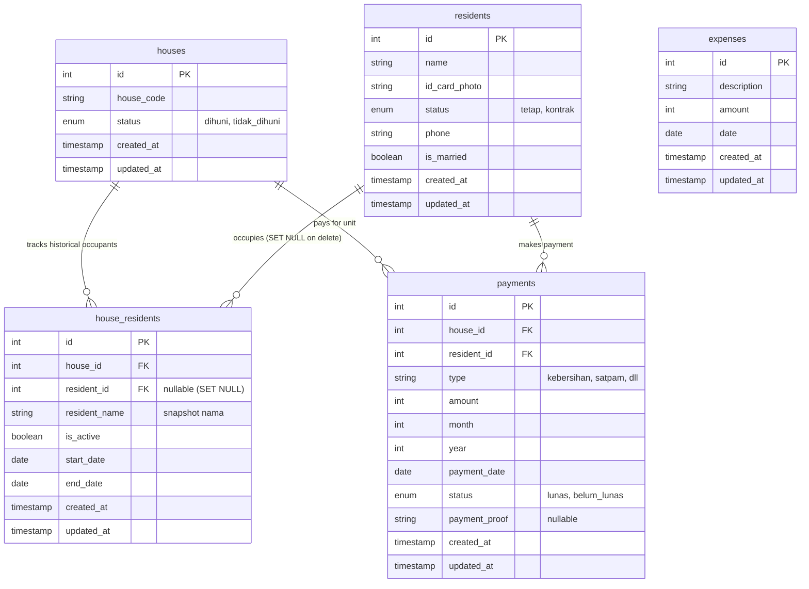

# Aplikasi Manajemen Administrasi & Keuangan RT

Aplikasi Full-Stack (Laravel 12 + React) untuk mengelola data warga, hunian rumah, riwayat okupansi, pembayaran iuran wajib bulanan (Kebersihan & Satpam), serta pencatatan pengeluaran kas RT.

Aplikasi ini menggunakan konfigurasi **Single-Server**, di mana React dibundel langsung ke dalam direktori public Laravel, sehingga Anda hanya perlu menjalankan satu server (`php artisan serve`) untuk menjalankan seluruh web app dan API.

---

### 1. Entity Relationship Diagram (ERD)

Berikut adalah skema database MySQL yang digunakan (dirender menggunakan sintaks Mermaid):



> 📌 **Catatan Desain Database:**
> Kolom `resident_id` pada tabel `house_residents` dikonfigurasi sebagai **`SET NULL`** jika warga dihapus, dengan nama lengkap warga dibackup sebagai snapshot di kolom `resident_name`. Desain ini menjamin integritas data sehingga **riwayat hunian rumah tidak akan hilang atau berubah** meskipun data warga diubah (nama disinkronkan) atau dihapus secara permanen dari sistem.

---

## 2. Panduan Instalasi & Uji Coba Cepat

Ikuti langkah-langkah di bawah ini untuk menyiapkan aplikasi di lingkungan lokal Anda (misalnya menggunakan XAMPP/Laragon):

### Prasyarat Sistem:
- **PHP >= 8.2** (pastikan ekstensi `pdo_mysql`, `fileinfo`, dan `gd` aktif)
- **Composer >= 2.x**
- **Node.js >= 18.x** & **NPM**
- **MySQL / MariaDB** (melalui XAMPP, Laragon, atau instalasi mandiri)

---

### Langkah 1: Setup Lingkungan & Database
1. Buka terminal/command prompt di direktori project, lalu salin file `.env` dan pasang dependensi PHP:
   ```bash
   copy .env.example .env
   composer install
   ```

2. Jalankan perintah pembuatan application key Laravel:
   ```bash
   php artisan key:generate
   ```

3. Sesuaikan konfigurasi database Anda di dalam file `.env`:
   ```env
   DB_CONNECTION=mysql
   DB_HOST=127.0.0.1
   DB_PORT=3306
   DB_DATABASE=system_rt
   DB_USERNAME=root
   DB_PASSWORD=
   ```

4. Buat database baru bernama `system_rt` di MySQL Anda (melalui phpMyAdmin atau client database lainnya).

5. Jalankan migrasi tabel beserta pengisian data uji coba awal (seeder):
   ```bash
   php artisan migrate:fresh --seed
   ```
   *Catatan: Database Seeder akan otomatis membuat 20 unit rumah (A-01 sampai A-20), data warga, riwayat hunian, catatan iuran wajib untuk 6 bulan terakhir, serta log pengeluaran agar grafik dashboard langsung tampil informatif.*

6. Buat link storage agar foto KTP warga dapat diakses di browser:
   ```bash
   php artisan storage:link
   ```

7. Bersihkan cache konfigurasi Laravel jika diperlukan:
   ```bash
   php artisan config:clear
   php artisan cache:clear
   php artisan view:clear
   ```

---

### Langkah 2: Instalasi Dependensi Frontend
Aplikasi ini berjalan dengan bundling terpadu. Jalankan perintah berikut untuk menginstal dependensi JavaScript dan mem-build aset frontend:
```bash
npm install
npm run build
```

---

### Langkah 3: Menjalankan Server & Uji Coba
Untuk menjalankan aplikasi, Anda **cukup menjalankan satu perintah server Laravel saja**:
```bash
php artisan serve
```

Akses aplikasi melalui browser Anda di:
👉 **[http://127.0.0.1:8000](http://127.0.0.1:8000)**

> 💡 **Tips Pengembangan (Development):** Jika Anda ingin memodifikasi file React/CSS di folder `frontend` dan melihat perubahannya langsung secara real-time di browser tanpa perlu menjalankan `npm run build` berulang kali, jalankan perintah watcher berikut di terminal kedua:
> ```bash
> npm run dev
> ```

---

## 3. Fitur Utama Aplikasi

1. **Dashboard Utama**:
   - Kartu KPI: Jumlah Warga, Unit Terisi/Kosong, Total Pemasukan Kas, Sisa Saldo Kas RT.
   - **Okupansi Rumah otomatis**: Status hunian (Terisi/Kosong) diperbarui secara real-time mengikuti perubahan status penghuni aktif di unit rumah.
   - Grafik Interaktif (Pemasukan vs Pengeluaran) selama 12 bulan terakhir.
   - Daftar otomatis rumah yang menunggak (belum lunas) di bulan berjalan (otomatis diurutkan berdasarkan kode rumah secara alami).

2. **Kelola Warga**:
   - Menambah & mengubah warga (Nama, Telepon, Status Pernikahan, Status Hubungan Tetap/Kontrak).
   - Unggah foto KTP warga secara aman dengan preview popup visual.

3. **Kelola Hunian Rumah**:
   - Peta interaktif grid unit rumah berkode yang **otomatis terurut secara alami (natural order)** seperti `A-01, A-02 ... A-20` meskipun ada penambahan unit baru.
   - Dengan badge warna hijau untuk rumah yang terisi (status tetap), kuning untuk status kontrak, dan abu-abu untuk rumah yang kosong.
   - Panel detail rumah: Menampilkan profil penghuni aktif saat ini & daftar riwayat penghuni masa lalu (dengan format tanggal Bahasa Indonesia, contoh: `5 Jul 2026`).
   - Fitur Asosiasi: Memasang penghuni baru atau mengosongkan rumah dengan otomatis mencatat tanggal mulai/selesai sewa.
   - **Hapus Unit Rumah**: Tombol hapus tersedia di modal edit rumah. Menghapus unit secara permanen beserta penghuni aktif yang terhubung, riwayat hunian, dan catatan iuran terkait.
   - **Preservasi Riwayat**: Ketika data warga diubah atau dihapus, riwayat hunian di rumah tersebut tetap terjaga utuh berkat penyimpanan snapshot nama penghuni (`resident_name`).

4. **Kelola Penerimaan Iuran**:
   - Matriks Bulanan: Menampilkan status lunas/belum lunas untuk setiap jenis iuran per rumah (diurutkan berdasarkan kode rumah secara alami).
   - Input Iuran Massal: Mendukung pembayaran beberapa bulan sekaligus (contoh: langsung bayar 12 bulan untuk Iuran Kebersihan).
   - **Jenis Iuran Dinamis**: Jenis iuran (label & nominal) dapat ditambah atau dihapus langsung dari antarmuka tanpa mengubah kode, disimpan di `localStorage`.
   - **Format Tanggal Lokal**: Kolom TGL BAYAR dan semua tampilan tanggal menggunakan format Bahasa Indonesia (contoh: `5 Jul 2026`). Tanggal default otomatis mengikuti waktu lokal perangkat (bukan UTC).

5. **Kas & Pengeluaran**:
   - Pencatatan pengeluaran kas RT (Keterangan, Nominal, Tanggal).
   - Buku Kas Bulanan: Laporan rinci ledger kas masuk & kas keluar untuk bulan tertentu.

---

